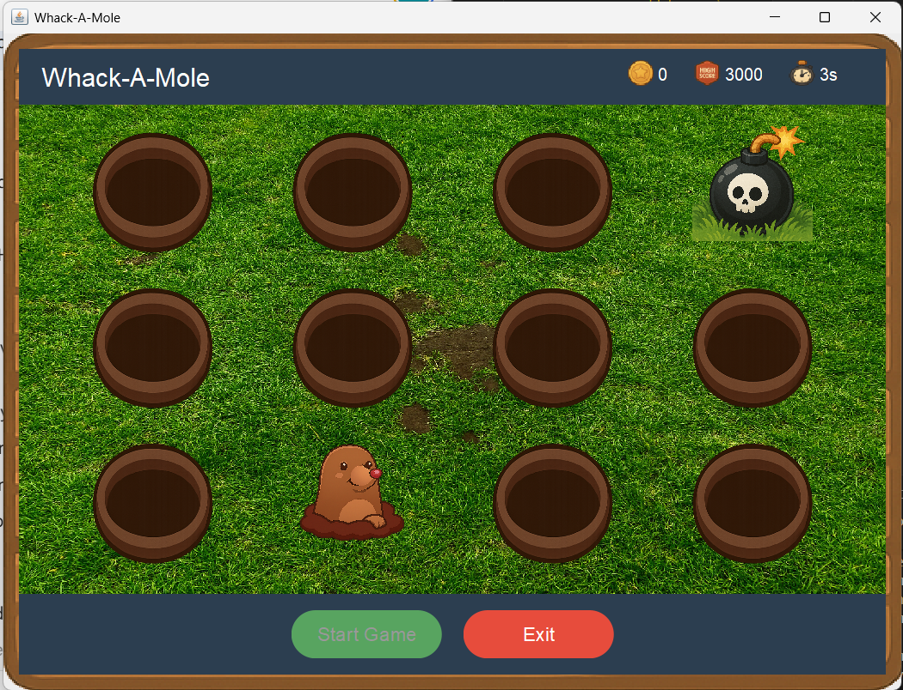

# Whack-a-Mole (Java Swing)

A classic arcade game recreated using Java Swing and AWT. The objective is simple: whack the moles as they pop up to score points, but be quick before they disappear!

## 🎮 Features
- **Graphical User Interface:** Built with Java Swing components.
- **Score Tracking:** Keeps track of your current score.
- **Randomized Logic:** Moles appear at unpredictable intervals and locations.
- **Custom Exception Handling:** Includes `InvalidGameStateException` for robust error management.

##  Tech Stack
- **Language:** Java
- **GUI:** Java Swing, AWT
- **IDE:** VS Code / BlueJ

##  How to Run
1. Clone the repository:
   ```bash
   git clone [https://github.com/velagalasuryaprakashreddy2007/WhackAMole_Game.git](https://github.com/velagalasuryaprakashreddy2007/WhackAMole_Game.git)

## Screenshots

